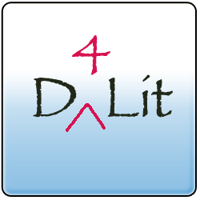

# Design for Literature

>Currently working on the first version (0.1.0). Aiming for a demo of some of the
features by April 7, 2014.

> Information about this project: http://designforliterature.com or <info@designforliterature.com>.
> To contact me: <rk@post.harvard.edu>.
>

## HIRA Model RESTful service and UI Reference Implementations

> This is a RESTful service implemented in node.js/express and an user interface
implemented in HTML5/CSS3/Javascript/Angularjs using MongoDB as a plugin database.

> The reference model is used to guide and evaluate the HIRA spec. The first
draft version of HIRA will be published in the Spring of 2014.

> Most of the features implemented here are still experimental and the system
is not intended to be used in production environments. However, it is available in this open
Github repository to provide transparency to and facilitate
communication with collaborators.

## Web Socket and HTTP Connection Management

> Web socket connections are used in a variety of ways:
1. To receive notifications from servers.
2. To receive transaction completion messages from servers for long running transactions.
3. To handle messaging within users of a "library" (a group of owners and editors of that library)
4. To handle messaging in chat rooms.

> http responses and websocket messages bound to clients are JSON objects
 with the following fields:
- `<type>` := A string code indicating whether the transaction was successful or not.
- `<msg>` := A readable message indicating the specific error. This is only used for debugging at present.

> Type:

- fatal:     A fatal server-side system error. The message is for debugging use only; clients
            should be given an appropriate, simple message. The message should be logged
            to the console to facilitate client-side debugging.

- trans:     A possibly transient server-side system error. The message is for debugging use only; clients
            should be told that they should try the operation again or later. The message should be logged
            to the console to facilitate client-side debugging.

- error:     An error for the client. The client should present the message as an error notification
            to the user who may need to take some corrective action. The message should be logged
            to the console to facilitate client-side debugging.

- warn:      A warning for the client. The client may present the message payload
            as a warning notification.

- ack:       An acknowledgement that a socket transaction or any other http request has succeeded.

- note:      A note for the client. The client may present the message as an
            informational notification.

## Server-side Errors

> Thrown errors must have a type and msg field (as in notifications).
All errors of type 'fatal' and 'trans' must be caught and logged; all
other errors must be delivered to the client through the notification
or some other client-facing mechanism.

>The try/catch mechanism should expect only error types 'fatal', 'trans' and 'error'.

## Server-side Websocket Management

> Sockets are cached on a per-session basis to permit access
to them at any time. This allows us to use socket communications in any context.

## Database

> Values all stored as strings for now to simplify migration to other DBs
and to use DBs as plugins. To facilitate prototyping the first version,
we're now using MongoDB and will migrate to HBase or Cassandra at a later time.

### TODO
- upload content
- Link to browse section when search result is selected.
- implement libraries with permissions, users, catalogs and content copies, etc.
  libraries are distributed (library comm protocol)
- add publication date (day, month, year separately or partially)
- subject/keyword widget using typeahead for loosely constrained entries.
