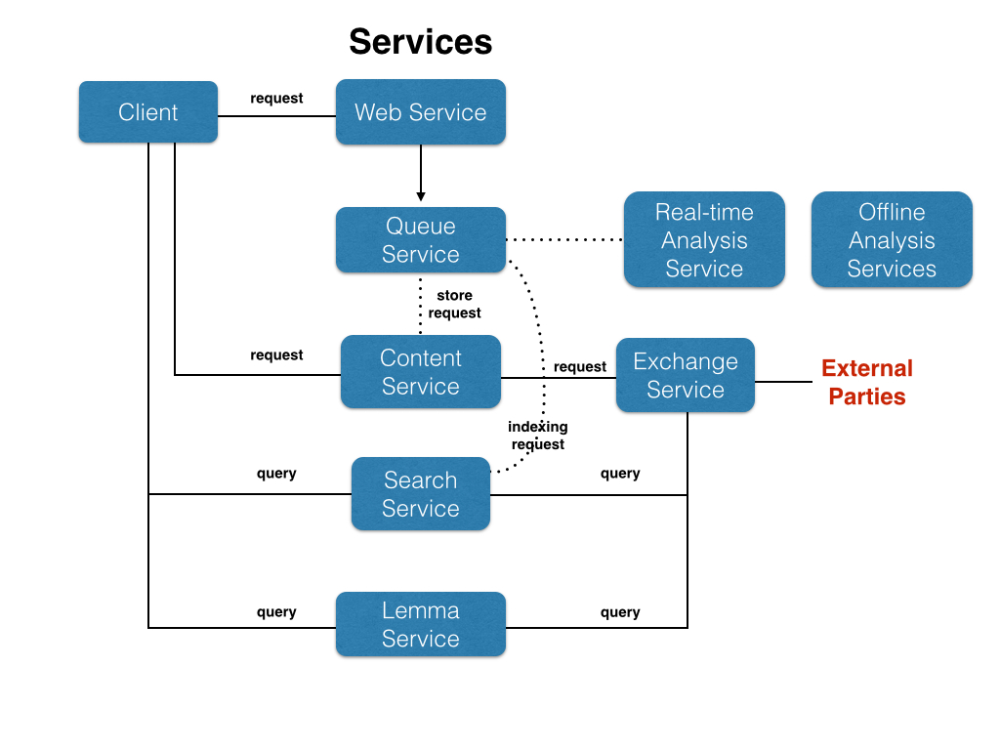
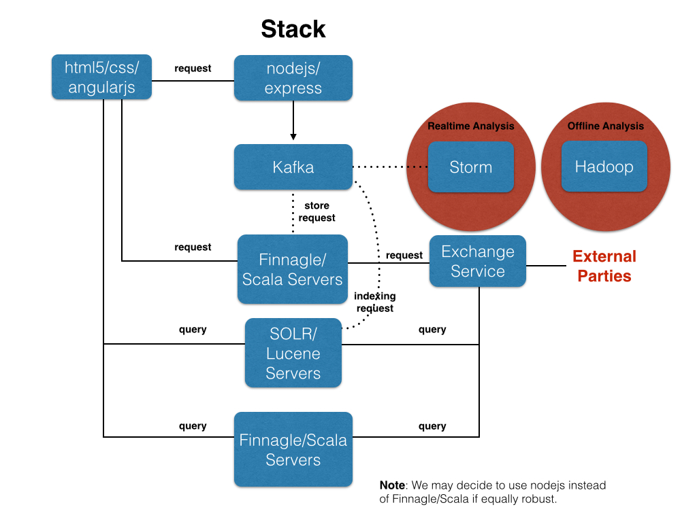

# Design for Literature
Copyright (c) 2014 Ruben Kleiman under Creative Commons Attribution-ShareAlike 4.0 International License.
This work is licensed under the Creative Commons Attribution-ShareAlike 4.0 International License.
To view a copy of this license, visit http://creativecommons.org/licenses/by-sa/4.0/ or send a letter
to Creative Commons, 444 Castro Street, Suite 900, Mountain View, California, 94041, USA.

Currently working on the first version (0.1.0). Demo of some of the
features now available (April 7, 2014). (See *Roadmap*, below.)

Information about this project: http://designforliterature.com or <info@designforliterature.com>.

To contact Ruben Kleiman: <rk@designforliterature.com> or <rk@post.harvard.edu>.

## Single-Machine, Development Installation

##### IMPORTANT: this is an early, pre-release version, so it's not recommended that you install it yet--not to mention to use it. But if you do install it and encounter any problems getting the initial screen/page (not bugs!), please report them to me.

- Install (1) `git`, (2) latest `nodejs`, and (3) `MongoDB 2.4.x`
- Open a Unix shell and clone this git directory: `git clone https://github.com/design4literature/web`
- To start the DB server, execute the shell script `web/scripts/start_db.sh`. **Read the instructions
in the latter file before starting the server for the first time.**
- To run the server, in a Unix shell cd to the cloned web directory and run the script `scripts/run-webserver.sh`
- To run the client open a browser (preferably not IE) and enter `http://localhost:3000`
- To stop operations, you can Control-C or kill the node process and then Control-C or kill the DB process.

## Architecture

The target architecture is based on various services and clients: All services
communicate via HTTP or through the Queue Service

#### Client
This is an HTML5/CSS3/JS/ANGULARJS client for browsers. As much processing as possible
is delegated to it.

#### Web Server
This is a NODEJS/EXPRESS service. It handles basic client
processing (templates, data translation, user authentication, etc.)

#### Exchange Service
Services requests by external APIs and parties, permitting the
APIs among the DFL services to develop independently of existing "standards."

#### Queue Service
This is a persistent, distributed queue (probably Kafka) through which
various services delegate work.

#### Search Service
This will probably be a SOLR/Lucene service. The service will
handle indexing and search for catalogs and for content. It picks
up requests either through HTTP or from the Queue Service.

#### Content Service
This service stores and retrieves catalog metadata or content. It picks up requests
from the Queue Service and HTTP.

#### Lemma Service
Handles storage and provision of lexicon look-ups by clients.

#### Exchange Service
Provides RDF and other APIs conforming to external parties
to provide and retrieve catalog metadata and content. Also
provides an API for creating definitions for the Lemma Service.

#### Analytics Services
A variety of services for analyzing the content and incoming
events from Queue Service. There are real-time and offline services.
The real-time services (based on Storm) provide immediate analysis of data,
whereas the offline services (based on Hadoop) provide "big data"
analysis that is more appropriate for offline work.

## `HIRA` Reference Implementation

The reference model is used to guide and evaluate the HIRA spec. The first
draft version of HIRA will be published by mid-2014.

Due to resource constraints we will approach the target in increments.
For the first version, the strategy is to bundle the separate services into
a minimal set: one server (called the "bundled server") and one client. What would otherwise be separate
services will be isolated in the code with wrappers called managers. For example, catalog search and indexing
would be wrapped by searchManager.js, and the bundled server would delegate indexing and search
requests from the client to this manager. Eventually, when we implement a search service (e.g., SOLR),
the client would directly make requests to the search service (using the same API).
Another example would be storing a catalog item's metadata or some content: in this
case, the storeManager.js wrapper would initially handle this, but when a
separate Content Service is implemented, the manager would simply put the request
into the Queue Service and the Content Service would pick up the request from there.

All components communicate via a `RESTful` http protocol or the Queue Service.

When possible, a `RESTful` service is implemented in node.js/express. Clients are
implemented in `HTML5/CSS3/Javascript/Angularjs`. For more sophisticated
search and analytics, services will be provided in Scala/Finnagle and SOLR
(simply because nodejs doesn't have good implementations of some needed libraries).

We consider DBs as plugins. Initially, the reference implementation
uses `MongoDB` because it helps to do rapid development, though for
production reasons we will move to `HBase` or `Cassandra` within
a few months.

Most of the features implemented here are work-in-progress and until the version 0.1.0 release the system
is not intended to be used in production environments. However, it is available in this open
Github repository to provide transparency to and facilitate
communication with collaborators.

## Roadmap
- `April 7, 2014`: [Done] Demo milestone (see Demo Wishlist, below) (with an update available every other week thereafter).
- `Date TBD`: First release: 0.1.0
- `Date TBD`: Lemma Service Integration. The lemma service provides lemma lookups for Design for Literature clients. The lemma service is implemented as a Finnagle/Scala server and
may be found at https://github.com/rubenkleiman/lemma-service.

The demo milestone is a tool for showing some of the ideas while recruiting
volunteers and obtaining funding.

The first release is gated by volunteers and/or funding resources.

### Demo Wishlist
- Create catalog items (done)
- Upload content for catalog items for Catullus and Iliad (done)
- Search catalog (done)
- Read content and navigate it with table of contents (done)
- Sign-in and signup (done)
- Annotate content and persist notes (done)
- libraries with permissions, users, catalogs and content copies, etc.
  (not necessary for demo but would be nice: libraries are distributed (library comm protocol))

## Implementation Notes
### Web Socket and HTTP Connection Management

Sockets are cached on a per-session basis to permit access
to them in *any* context.

 Web socket connections are used in a variety of ways:
- To receive notifications from servers.
- To receive transaction completion messages from servers for long running transactions.
- To handle messaging within users of a "library" (a group of owners and editors of that library)
- To handle messaging in chat rooms.

 http responses and websocket messages bound to clients are JSON objects
 with the following fields:
- `type` := A string code indicating whether the transaction was successful or not.
- `msg` := A readable message indicating the specific error. This is only used for debugging at present.

**Types**:

- `fatal`:     A fatal server-side system error. The message is for debugging use only; clients
            should be given an appropriate, simple message. The message should be logged
            to the console to facilitate client-side debugging.

- `trans`:     A possibly transient server-side system error. The message is for debugging use only; clients
            should be told that they should try the operation again or later. The message should be logged
            to the console to facilitate client-side debugging.

- `error`:     An error for the client. The client should present the message as an error notification
            to the user who may need to take some corrective action. The message should be logged
            to the console to facilitate client-side debugging.

- `warn`:      A warning for the client. The client may present the message payload
            as a warning notification.

- `ack`:       An acknowledgement that a socket transaction or any other http request has succeeded.

- `note`:      A note for the client. The client may present the message as an
            informational notification.

Server-side, thrown errors must have a type and msg field (as usual).
All errors of type 'fatal' and 'trans' must be caught and logged; all
other errors must be delivered to the client through the notification
or some other client-facing mechanism.

### Database

To facilitate prototyping the first version, we're now using `MongoDB` and
will migrate to `HBase` or `Cassandra` at a later time.

### Backend

The backend will eventually consist of a distributed queue (e.g., `Kafka`) feeding
into various processes--some of them implemented in `Storm`.